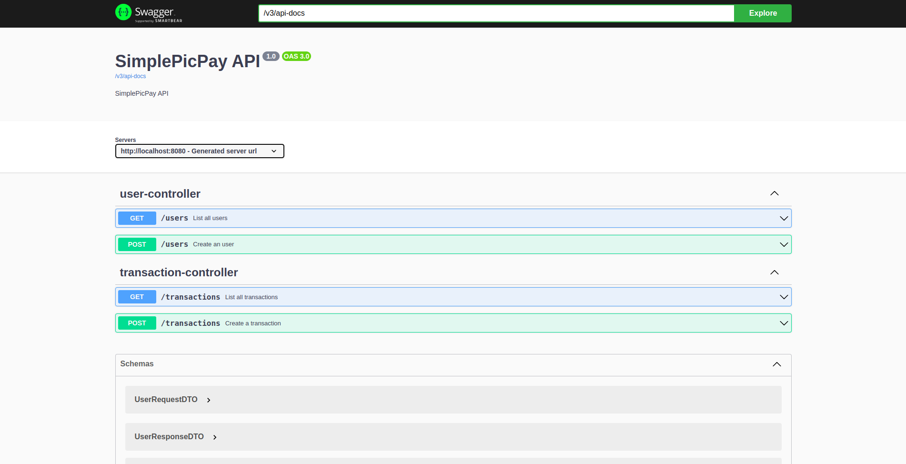

# SimplePicPay
### Minha resolução para o desafio técnico do PicPay

Link para o repositório do desafio [aqui](https://github.com/PicPay/picpay-desafio-backend)

### Tecnologias utilizadas
- Java e Spring
- Maven
- Docker e Docker Compose
- H2 e PostgreSQL
- Swagger

### Como utilizar
__Primeiramente, é necessário ter instalado em seu computador o Docker e o plugin Docker Compose.__

Este projeto possui dois perfis: um de __testes__ e um de __desenvolvimento__.

No perfil de testes, são executados os testes da aplicação, enquanto no perfil de desenvolvimento a aplicação
é iniciada e fica disponível no seu host local como se estivesse em produção.

#### Executando o perfil de testes:
Para executar o perfil de testes, utilize o seguinte comando: 
```shell
docker compose -f docker-compose.test.yaml up --build
```
Automaticamente a aplicação será construída e os testes irão ser executados em seguida.

Quando os testes encerrarem, derrube o container com o seguinte comando:
```shell
docker compose -f docker-compose.test.yaml down
```

Assim o container de testes, ainda em execução, será encerrado.

#### Executando o perfil de desenvolvimento:
Para executar o perfil de desenvolvimento, vamos utilizar uma abordagem similar ao perfil de testes.
Execute o seguinte comando:
```shell
docker compose -f docker-compose.dev.yaml up --build -d
```

Dessa forma, a aplicação será construída e os container serão executados em segundo plano, deixando
seu terminal livre.

A API está __totalmente documentada__ utilizando o Swagger. Então, após subir os containers no perfil de
desenvolvimento, acesse a url *__http://localhost:8080/swagger-ui/index.html__* para ter acesso
à documentação completa da API.


